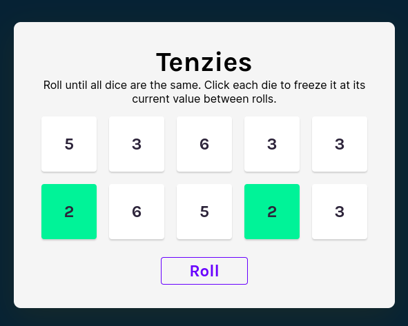

# tenzies-react

> Dice game on **React**. Basic educational project.
> Live demo [_here_](https://sashauly.github.io/tenzies-react/).

## Table of Contents
- [tenzies-react](#tenzies-react)
  - [Table of Contents](#table-of-contents)
  - [General Information](#general-information)
  - [Technologies Used](#technologies-used)
  - [Features](#features)
  - [Setup](#setup)
  - [Project status](#project-status)
  - [Room for Improvement](#room-for-improvement)
  - [Acknowledgements](#acknowledgements)
  - [Contacts](#contacts)
<!-- * [License](#license) -->

## General Information
- This project was made to consolidate the knowledge of working with **React hooks**

## Technologies Used
- JavaScript ES6
- [React 18.2.0](https://react.dev/)
- [react-confetti 6.1.0](https://github.com/alampros/react-confetti)
- [nanoid 4.0.2](https://github.com/ai/nanoid)
- [vite 4.4.0](https://vitejs.dev/)

## Features
List the ready features here:
- Click on dice face and roll the dice again until all of the faces became the same.
- And then game is over, get your confetti!

## Setup
Just open [the live version](https://sashauly.github.io/tenzies-react/). For now this project served for presentation purposes

## Project status

Project is: _complete_

## Room for Improvement
- Add timer
- Add score
- Add limit to roll the dice

## Acknowledgements
- This project was based on [this Scrimba course tutorial](https://scrimba.com/learn/learnreact).

## Contacts

Created by [@sashauly](https://t.me/sashauly) - feel free to contact me!
